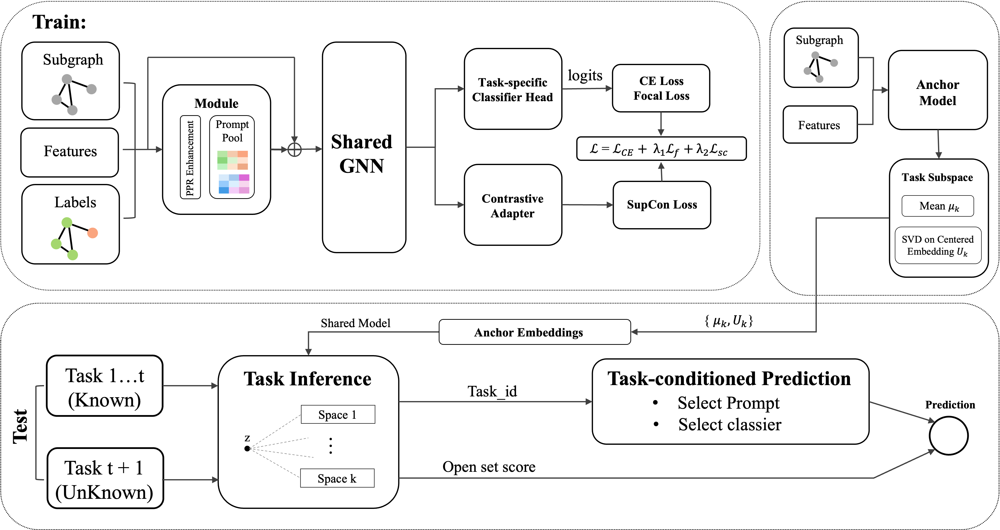

# SAFER
code for Subspace-Aware Feature Reshaping for Open-Set Graph Class-Incremental Learning
## Abstract
Graph class-incremental learning (GCIL) has emerged to address the challenge of learning from dynamically evolving graphs, which continuously learns new classes over a sequence of tasks while retaining performance on previously seen classes. However, existing GCIL methods assume a closed-set test distribution drawn only from seen tasks. This fundamentally contradicts real-world open-ended scenarios where future unknown classes inevitably emerge. Empirically, we observe that existing GCIL methods falter in such open-set settings due to severe representation drift and generalized overconfidence. To bridge this gap, we investigate the Open-Set GCIL problem and propose **SAFER** (**S**ubspace-**A**ware **FE**ature **R**eshaping), a novel framework that endows GCIL with intrinsic open-set capabilities under a replay-free constraint. Specifically, **SAFER** performs subspace-aware feature reshaping with drift-resilient fingerprints, unifying task routing and open-set rejection into a single energy-based metric. Furthermore, we introduce a geometric space-consistency regularization that explicitly improves intra-class compactness and suppresses cross-task representation drift. Extensive experiments on four benchmarks demonstrate that SAFER outperforms state-of-the-art baselines by margins of up to 5.2\% in accuracy and 31.3\% in open-set AUROC, all while maintaining near-zero forgetting under strict no-replay constraints. 

The following figure shows the SAFER framework in details.



## Experiment environment
To run the code, the following packages are required to be installed:

-python==3.8.19

-torch==1.13.1

-dgl==1.0.1+cu117
## Usage
To reproduce the results of Table 1, please run the run.sh:
```
./run.sh
```
## Acknowledgments
This code is based on [TPP](https://github.com/mala-lab/TPP) and [CGLB](https://github.com/QueuQ/CGLB/tree/master). Please refer to their repositories for additional baselines and implementation details.
